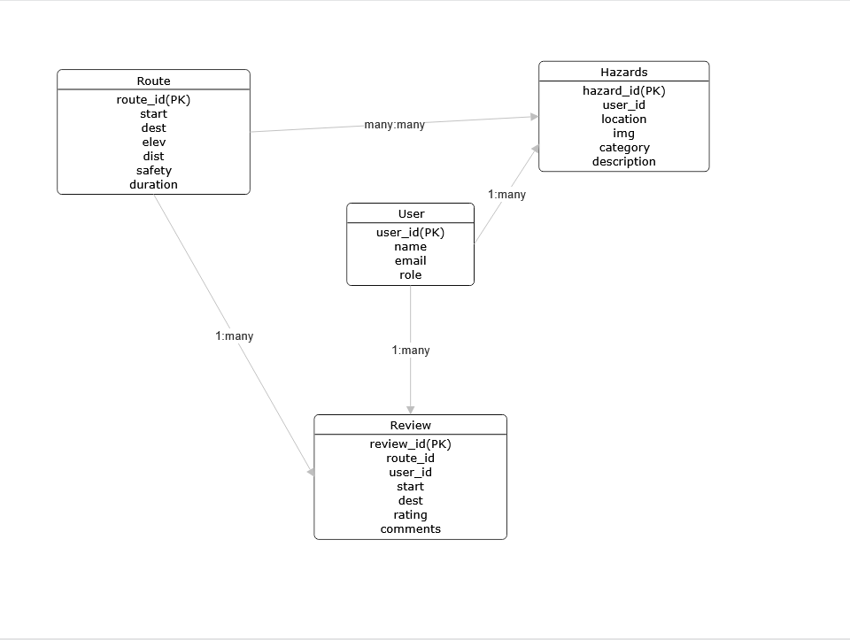

[](https://classroom.github.com/a/lywCqags)

---
# BikeSafe Vancouver
### CMPT 372 - Project Proposal
Group 10: Elton Chen, Tim Supan, Rohin Aulakh, Dat Chau, Yu Wu

# Setup
Deployed URL - https://34.187.197.133/  
Both DB and Web-app deployed on GCP VM instances  
No container system used so far

### The name of our application is BikeSafe
A web application designed to help cyclists plan their routes according to safety, not just distance and elevation. In addition, it will provide information on bike dock availability for bike share services. This application would also provide navigation and real-time user reported alerts to improve biking experience around the city. Moreover, our application would provide route discovery and reviews of existing routes based on users in their area. 

### The problem we aim to solve
Current route planning apps treat all roads as interchangeable and do not consider safety as part of their route planning. 
- Strava - focuses on route discovery, live trip tracking, social competition
- Google - basic bike routing, bike share dock info, navigation
- Komoot - route planning with difficulty ratings, offline map download feature
- https://vancouver.bikerouteplanner.com/ - focused purely on safe route planning

Many of these applications focus on one aspect of biking whilst ignoring the other features. We aim to integrate all aspects vital to biking safely in Vancouver involving route safety ratings, hazards, trip planning, etc. into one web application. This idea stems from common quips about existing apps in this field: *“I find Google maps often suggests dangerous and high-traffic bike routes. For example, biking down Broadway (no bike lane) when there is a dedicated bike road (west 8th) directly next to Broadway. - user on Reddit*”

### Target Audience
The primary audience would be cyclists in the Vancouver area such as, daily commuters, students, tourists, delivery riders, people riding bikes for fun, and even e-scooter or e-bike riders wanting to get around the city better and safer.

---

## Final Update

The sections further below are the original project proposal, kept as-is for reference. This section documents the most current, state of the web app.

### Feature Updates by Epic

#### Route Planning
- **Route planning core** — set a start and destination by clicking the map or searching an address (forward/reverse geocoded via OpenRouteService), and get back a real road-following cycling route (not a straight line), with distance, duration, and elevation gain.
- **Safety scoring** — every computed route is scored 0–100 based on proximity to reported hazards. See "Safety Scoring Mechanics" below.
- **Hazard-avoidance routing** — nearby hazards are converted into small exclusion zones and passed to OpenRouteService, so a route can genuinely reroute around them, not just get penalized after the fact. Falls back gracefully to a direct route if no viable detour exists.
- **Alternative routes** — multiple route options are returned per request, each labeled and scored; the safest is auto-selected by default, with a picker to choose a different one.
- **Save / view / delete routes** — authenticated users can save a computed route, revisit it later (re-selecting it recomputes the same trip live), and delete their own routes.
- **Live navigation** — an optional live position marker on the map, using the browser's built-in Geolocation API (`watchPosition`) — no external service involved. Requires HTTPS or `localhost`; will not function on the current plain-HTTP production deployment (see Known Limitations below).
- **Hazards visible while planning** — hazard markers render on the route-planning map itself, not just on the dashboard.

#### Hazard Reporting & Analytics
- **Report a hazard** — title, description, category, severity (1–5), and location, set either by manual lat/lon entry, "use my current location" (browser Geolocation), or clicking the map.
- **Hazard dashboard** — a recent-reports feed, a stat grid (reported today / this week / all-time / by you, average severity, most-reported category), and a map of all hazards.
- **Hazard CRUD API** — list, per-category/status stats, get by id, create, update, and admin-only delete.
- Not yet wired up: a resolved/unresolved status breakdown exists as commented-out code in `Hazards.tsx` but isn't currently displayed; no heatmap of high-report areas yet.

#### Admin System
- **User management page** — admins can view all registered users, promote/demote roles (blocked from changing their own role), and delete users (blocked from deleting themselves).
- Admin privileges are also checked directly inside other routers, not just a standalone admin page — e.g. `hazards.ts` restricts hazard deletion to admins, and `routes.ts` lets an admin delete *any* user's saved route, not just their own.

#### Bike Share
- **Live bike/scooter availability map** — shows Lime stations and free-floating vehicles, refetching (debounced) as the user pans/zooms the map, with a "last updated" timestamp.
- Backend proxies and cleans Lime's public GBFS feed, filtered to the visible map bounds and briefly cached server-side.

#### Route Logging & Reviews
- **Community review feed** — browse reviews left on saved routes, each showing the route, reviewer, rating, and comment.
- **Search & filter** — case-insensitive search across route names, comments, and reviewer name, plus a "my reviews only" filter.
- **Review CRUD** — signed-in users can add a review on any saved route, and edit or delete only their own (enforced server-side, not just hidden in the UI).

### Current Architecture (as implemented)

A few things evolved from the original proposal below — noted here rather than edited into that section:

- **Monorepo.** `frontend/` and `backend/` are two fully independent npm projects — separate `package.json`s, separate dependency trees, no workspace configuration, and no shared code (types are hand-mirrored between `backend/types/` and `frontend/src/types.ts`, not imported from a shared package).
- **CORS is actively required in production**, rather than avoided as originally planned. The frontend and backend are not served in a way that avoids cross-origin requests — `credentials: true` CORS is needed for the cookie-based auth to work correctly (this was required specifically to fix admin hazard deletion).
- **Production in HTTPS.** Concrete consequences: the auth cookie's `secure` flag is hardcoded `false`, and the Geolocation API used for live navigation requires a secure context — so live navigation does not currently function on the deployed site.

**Stack, as built:**
```
React SPA (Vite)  ──REST/JSON──►  Express API  ──SQL──►  PostgreSQL
                                        │
                                        ├──► OpenRouteService (geocoding, routing)
                                        └──► Lime GBFS feed (bike-share data)
```

- **Backend** — one Express router per domain (`auth`, `admin`, `hazards`, `bikeShare`, `routes`, `geocode`, `reviews`), raw parameterized SQL via `pg` (no ORM), JWT auth delivered via an `httpOnly` cookie, role-gated middleware (`requireAuth`, `requireAdmin`).
- **Frontend** — React 19 + Vite, no external state management library, `services/api.ts` centralizes all backend calls, `Map.tsx` wraps Leaflet imperatively (not `react-leaflet`, despite it being installed).
- **API docs** — `swagger-jsdoc` + `swagger-ui-express`, served live at `/api-docs` on the running backend.

### Safety Scoring Mechanics

Avoidance and scoring are two independent systems, not one unified algorithm:

- **Avoidance** shapes what OpenRouteService computes: nearby hazards are buffered into small exclusion polygons and passed as `avoid_polygons`, so a route structurally cannot cross into them.
- **Scoring** independently judges whatever path comes back: starting at 100, every hazard within 50m of the path (checked against the *entire* hazards table, not just the ones targeted for avoidance) deducts `severity × 3` points, clamped to 0–100.

Severity is the only differentiating factor in scoring — hazard category, recency, and exact distance (beyond the binary 50m cutoff) have no effect.

### External APIs

Both proxied server-side only — the frontend never calls either directly, and API keys never leave the backend:

- **OpenRouteService** (`api.openrouteservice.org`) — forward/reverse geocoding and cycling-profile routing, including alternative routes and hazard avoidance.
- **Lime GBFS feed** (`data.lime.bike`) — public, keyless bike-share data (station info/status, free-floating vehicles), cached briefly server-side (`node-cache`) to avoid re-fetching on every map pan.

### Testing Overview

**Backend** (`backend/test/`, run via `npm test`): Node's built-in `node:test` + `supertest`, exercising the real Express app in-process. The only things mocked are the two boundaries the app doesn't control — the database (`pool.query`) and external APIs (`fetch`); all routing, middleware, and business logic runs for real. Covers `auth`, `admin`, `hazards`, `geocode`, and `routes` (including the hazard-avoidance/alternative-routes orchestration and the safety-scoring math in isolation). Not yet covered: `bikeShare.ts`, `reviews.ts`, and the auth middleware in isolation (only exercised indirectly through routes that use it).

**Frontend** (`frontend/src/test/`, run via `npm test`): Vitest, deliberately minimal — no React Testing Library or DOM environment. Pure business logic is pulled out of page components into standalone modules and tested directly (e.g. `pickSafestIndex` — which alternative route to auto-select; `computeReportedToday`/`computeReportedByYou` — dashboard stats). Rendering, user interaction, and component-level behavior are not covered — this trades breadth for a fast, dependency-light suite focused on the highest-risk pure logic found so far.

### Known Limitations

- Live navigation requires a secure context (HTTPS/`localhost`) and requires user permission to access location.
- Nginx config needs to sync with both sides
- If Express server crashes, React frontend will still load but pages will not be shown
- Two builds increases complexity
- No rate limiting or brute force protection

## Screenshots of Current State:


## Wireframes:


---  

### Scope and Team Epic Assignment
This team was chosen based on Canvas’ random group join feature. Here is the mapping of members to epic/s, based on past project experiences and interest:

- **Tim** - Epic feature #1: Route planning through start and destination on map based on safety, elevation, distance, etc..
- **Rohin** - Epic feature #2: Hazard reporting and analytics, signed in users can report possible cycling hazards they see like construction, road closures, accidents, areas with bad drivers, bike thefts, recent reports, dashboard, heatmap of highly reported areas, etc…
- **Elton** - Epic feature #3: Admin system, manage user reports, manage users, remove fake reports.
- **Yu** - Epic feature #4: Mobi bike share/Lime scooter stations, show bike/scooter stations on map with the number of bikes available and pricing.
- **Dat** - Epic feature #5: Users can log routes they did and review them based on safety, elevation, distance, etc.. so that other users can see these reviews when they start a route that crosses the same streets.

---
### High-Level Architecture
BikeSafe uses Stack A: a separate React single-page front end and an Express/Node.js backend API, communicating using REST.

**Components**:
- Frontend: React(Vite), served as a static bundle
- Backend: Node.js + Express REST API
- Internal Service: SQL database running on the same or separate GCP Compute Engine VM
- External Service/API: City of Vancouver Open Data API for the Bikeways Dataset, datasets from bike share companies for availability data
- Deployment: Both Express API and static React will be served on the same GCP Compute Engine VM using nginx. SQL database on the same or separate VM instance to hold users, routes, bikeway segments and hazard reports.

### Entities and Key-Relationships
User(<u>user_id</u>, name, email, role)\
Route(<u>route_id</u>, start, destination, elevation, distance, safety, duration)\
Hazards(<u>hazard_id</u>, user_id, location, image, category, description)\
Review(<u>review_id</u>, route_id, user_id, start, destination, rating, comments)

A User can create many Hazards (1 to many)\ 
A User can write many Reviews (1 to many)\
Many Routes can have many Hazards (many to many)\
A Route can have many Reviews (1 to many)\



### Framework Justification
1. **Why two apps over one:** We can modify the backend without touching the frontend or modify frontend without touching the backend when needed. Better security and protection for valuable information and data.
2. **Repo structure:** A monorepo structure with workspaces to manage frontend and backend will be used. This will make managing dependencies and setting up the project easier for our group. It will also allow us to set up a CI/CD pipeline easier if we wish to do so. 
3. **How the two apps talk:** Same VM with nginx as a reverse proxy in front of both. Requests to /api/* are sent on an internal port and all other requests serve the react production build. This will avoid CORS configuration as both are served from the same origin.
4. **API style:** REST api is the default for this project’s scope.


